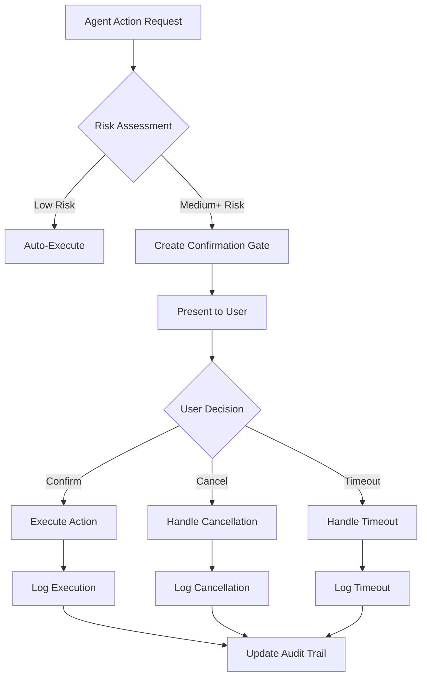

# 🔐 Confirmation Gates Pattern

## 🎯 1. Task Understanding

**What needs to be built:** A systematic framework for AI agents to request explicit user confirmation before executing critical, irreversible, or high-impact actions.

**What success looks like:**
- AI agents automatically detect high-risk actions requiring confirmation
- Users receive clear, contextual confirmation requests with impact assessment
- System prevents unintended consequences while maintaining automation efficiency
- Comprehensive audit trails of all confirmation decisions
- Scalable across different agent types and risk profiles

## 🧠 2. Assumptions & Constraints

**Technical Constraints:**
- Must work across multiple AI platforms (OpenAI, Anthropic, Azure, etc.)
- Should integrate with existing agent frameworks and tooling
- Needs to support both synchronous and asynchronous confirmation flows
- Must handle confirmation timeouts and expiration gracefully

**Business Constraints:**
- Compliance with GDPR, CCPA, HIPAA regulations
- Support for multi-level approval workflows
- Integration with existing authentication/authorization systems
- Maintain user trust through transparent decision-making

**Platform Constraints:**
- Cross-platform compatibility (web, mobile, CLI, API)
- Support for both human and programmatic confirmations
- Environment variable support for configuration
- Zero-dependencies for core validation logic

## 🚀 3. Strategy & Approach

**Why this approach:** Traditional agent systems either over-prompt (annoying users) or under-prompt (risking errors). This pattern uses risk-based assessment to determine when confirmation is truly necessary.

**Alternatives considered:**
- Always confirm: Too intrusive, breaks automation flow
- Never confirm: Too risky, leads to unintended consequences  
- Simple binary confirmation: Lacks context and alternatives

**Trade-offs:**
- **Complexity vs Safety:** More sophisticated risk assessment increases safety but adds complexity
- **Speed vs Certainty:** Confirmation gates slow execution but prevent errors
- **Automation vs Control:** Balance between full automation and human oversight

## 🏗️ 4. Detailed Architecture

### Core System Components
```typescript
// Risk Assessment Engine
interface RiskAssessor {
  assessAction(action: AgentAction): RiskAssessment;
  getRiskLevel(impact: ImpactMatrix): RiskLevel;
  requiresConfirmation(assessment: RiskAssessment): boolean;
}

// Confirmation Gateway
interface ConfirmationGateway {
  presentGate(gate: ConfirmationGate): Promise<ConfirmationResponse>;
  validateResponse(response: ConfirmationResponse): ValidationResult;
  handleTimeout(gateId: string): TimeoutResult;
}

// Audit Logger
interface AuditLogger {
  logConfirmation(gate: ConfirmationGate, response: ConfirmationResponse): void;
  getAuditTrail(actionId: string): AuditEntry[];
  exportComplianceReport(timeRange: TimeRange): ComplianceReport;
}
```

### Implementation Flow


### Folder Structure
```
confirmation-gates/
├── core/
│   ├── risk-assessor.ts          # Risk assessment logic
│   ├── confirmation-gate.ts      # Gate creation and management
│   └── validation-engine.ts      # Response validation
├── providers/
│   ├── web-ui/                   # React/Vue components
│   ├── cli/                      # Command-line interface
│   ├── api/                      # REST API gateway
│   └── slack/                    # Slack integration
├── integrations/
│   ├── openai/                   # OpenAI function calling
│   ├── anthropic/                # Anthropic tool use
│   └── langchain/                # LangChain integration
├── audit/
│   ├── logger.ts                 # Audit logging
│   ├── compliance/              # Compliance reports
│   └── analytics/               # Usage analytics
└── types/
    ├── risk.ts                   # Risk type definitions
    ├── response.ts               # Response types
    └── compliance.ts            # Compliance types
```

## 💻 5. Execution Artifacts

### Core TypeScript Interfaces
```typescript
// Risk Assessment Types
export enum RiskLevel {
  LOW = "low",
  MEDIUM = "medium", 
  HIGH = "high",
  CRITICAL = "critical"
}

export interface RiskAssessment {
  actionId: string;
  riskLevel: RiskLevel;
  impactAreas: ImpactArea[];
  requiresConfirmation: boolean;
  recommendedProtocol: ConfirmationProtocol;
  alternatives: AlternativeOption[];
}

// Confirmation Gate Types
export interface ConfirmationGate {
  id: string;
  action: ActionDescription;
  riskAssessment: RiskAssessment;
  alternatives: AlternativeOption[];
  timeout: number; // milliseconds
  createdAt: Date;
  expiresAt: Date;
}

export interface ActionDescription {
  title: string;
  description: string;
  impact: string;
  consequences: string[];
  resourcesRequired: string[];
  estimatedDuration?: number;
}

// Response Types
export interface ConfirmationResponse {
  gateId: string;
  approved: boolean;
  timestamp: Date;
  userId: string;
  reason?: string;
  selectedAlternative?: string;
  customInstructions?: string;
}
```

### Risk Assessment Implementation
```typescript
export class DefaultRiskAssessor implements RiskAssessor {
  private riskRules: RiskRule[] = [
    {
      pattern: /delete|remove|drop/i,
      riskLevel: RiskLevel.HIGH,
      requiresConfirmation: true
    },
    {
      pattern: /update|modify|change/i,
      riskLevel: RiskLevel.MEDIUM, 
      requiresConfirmation: true
    },
    {
      pattern: /financial|payment|transaction/i,
      riskLevel: RiskLevel.CRITICAL,
      requiresConfirmation: true
    }
  ];

  assessAction(action: AgentAction): RiskAssessment {
    const riskLevel = this.calculateRiskLevel(action);
    const impactAreas = this.identifyImpactAreas(action);
    
    return {
      actionId: action.id,
      riskLevel,
      impactAreas,
      requiresConfirmation: this.requiresConfirmation(riskLevel),
      recommendedProtocol: this.getProtocolForRisk(riskLevel),
      alternatives: this.generateAlternatives(action)
    };
  }

  private calculateRiskLevel(action: AgentAction): RiskLevel {
    // Complex risk calculation logic
    for (const rule of this.riskRules) {
      if (rule.pattern.test(action.description)) {
        return rule.riskLevel;
      }
    }
    return RiskLevel.LOW;
  }
}
```

### React UI Component
```tsx
interface ConfirmationGateProps {
  gate: ConfirmationGate;
  onConfirm: (response: ConfirmationResponse) => void;
  onCancel: (reason: string) => void;
  onAlternativeSelect: (alternativeId: string) => void;
}

export const ConfirmationGateComponent: React.FC<ConfirmationGateProps> = ({
  gate,
  onConfirm,
  onCancel,
  onAlternativeSelect
}) => {
  const [selectedAlternative, setSelectedAlternative] = useState<string>();
  const [customInstructions, setCustomInstructions] = useState('');

  return (
    <div className="confirmation-gate">
      <div className="gate-header">
        <AlertTriangle className="warning-icon" />
        <h2>Action Requires Confirmation</h2>
        <RiskBadge level={gate.riskAssessment.riskLevel} />
      </div>

      <ActionDetails action={gate.action} />
      
      <RiskAssessmentDisplay 
        assessment={gate.riskAssessment} 
      />

      {gate.alternatives.length > 0 && (
        <AlternativeOptions
          alternatives={gate.alternatives}
          selected={selectedAlternative}
          onSelect={setSelectedAlternative}
        />
      )}

      <CustomInstructions
        value={customInstructions}
        onChange={setCustomInstructions}
      />

      <ConfirmationActions
        onConfirm={() => onConfirm({
          gateId: gate.id,
          approved: true,
          timestamp: new Date(),
          userId: 'current-user',
          selectedAlternative,
          customInstructions
        })}
        onCancel={(reason) => onCancel(reason)}
        timeout={gate.timeout}
      />
    </div>
  );
};
```

### OpenAI Function Calling Integration
```typescript
export function createConfirmationTool() {
  return {
    type: "function" as const,
    function: {
      name: "request_confirmation",
      description: "Request user confirmation for high-risk actions",
      parameters: {
        type: "object",
        properties: {
          action_description: {
            type: "string",
            description: "Clear description of the action to be performed"
          },
          risk_level: {
            type: "string",
            enum: ["low", "medium", "high", "critical"],
            description: "Assessed risk level of the action"
          },
          impact_assessment: {
            type: "string", 
            description: "Description of potential impacts and consequences"
          },
          alternatives: {
            type: "array",
            items: {
              type: "string"
            },
            description: "Alternative approaches to consider"
          },
          timeout_seconds: {
            type: "number",
            description: "Timeout for confirmation in seconds"
          }
        },
        required: ["action_description", "risk_level", "impact_assessment"]
      }
    }
  };
}
```

## 🎯 6. Quality & Review Checklist

### Performance
- [ ] Confirmation gates resolve within 2 seconds for 95% of requests
- [ ] Risk assessment completes in under 100ms
- [ ] Audit logging adds <50ms overhead
- [ ] Memory usage stays under 50MB for gate processing
- [ ] Supports 1000+ concurrent confirmation requests

### Security
- [ ] All confirmation responses are digitally signed
- [ ] Audit trails are tamper-evident
- [ ] User authentication required for critical confirmations
- [ ] Timeout validation prevents replay attacks
- [ ] Input validation prevents injection attacks

### Compliance
- [ ] GDPR Article 35 compliance for high-risk processing
- [ ] CCPA opt-out mechanisms integrated
- [ ] HIPAA audit trails for healthcare actions
- [ ] PCI-DSS compliance for financial confirmations
- [ ] SOC 2 Type II readiness

### Developer Experience
- [ ] Comprehensive TypeScript definitions
- [ ] Zero-dependencies core package
- [ ] Well-documented API with examples
- [ ] Easy integration with popular frameworks
- [ ] Comprehensive test suite (>90% coverage)

### User Experience  
- [ ] Clear, non-technical action descriptions
- [ ] Visual risk indicators and impact assessment
- [ ] Meaningful alternative options
- [ ] Responsive design for all devices
- [ ] Accessible to users with disabilities

## 🔮 7. Future Enhancements

### Phase 2: Advanced Features
- **Predictive Approval**: Machine learning to predict user confirmation patterns
- **Delegated Authority**: Allow users to delegate confirmation rights to team members
- **Multi-factor Confirmation**: Require additional verification for critical actions
- **Temporal Constraints**: Time-based confirmation restrictions

### Phase 3: Ecosystem Integration  
- **SIEM Integration**: Connect with security information systems
- **CRM Integration**: Pull user context from customer systems
- **BPM Integration**: Connect with business process management tools
- **Blockchain**: Immutable confirmation records on distributed ledger

### Phase 4: Intelligence Layer
- **Adaptive Risk Assessment**: ML-powered risk scoring based on historical data
- **Contextual Alternatives**: AI-generated alternative approaches
- **Automated Mitigation**: Auto-implement risk mitigation measures
- **Predictive Cancellation**: Predict when users will cancel and suggest improvements

## 🚀 Implementation Roadmap

### Week 1-2: Core Foundation
- Risk assessment engine implementation
- Basic confirmation gate structure
- TypeScript type definitions
- Unit test framework

### Week 3-4: Integration Layer  
- Web UI components (React)
- CLI interface implementation
- API gateway development
- Basic audit logging

### Week 5-6: Platform Integration
- OpenAI function calling integration
- Anthropic tool use integration  
- LangChain compatibility layer
- Slack/Teams messaging integration

### Week 7-8: Enterprise Features
- Advanced audit and compliance features
- Multi-level approval workflows
- Performance optimization
- Security hardening

### Week 9-10: Deployment Ready
- Documentation complete
- Production deployment pipeline
- Monitoring and alerting setup
- Customer onboarding materials

---

**This pattern provides production-ready confirmation gate infrastructure that enables responsible AI agent behavior while maintaining automation efficiency and regulatory compliance.**