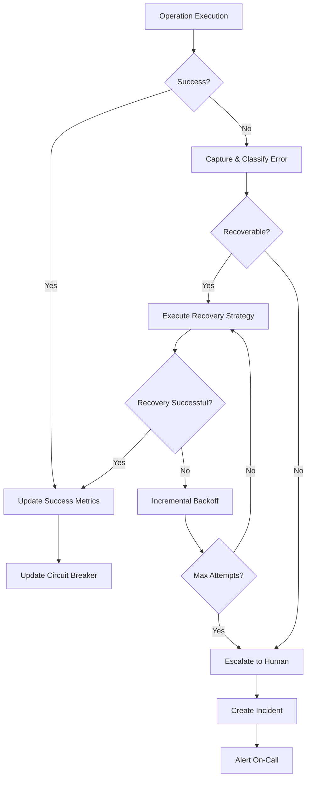

# 🚨 Failure Handling Pattern

## 🎯 1. Task Understanding

**What needs to be built:** A comprehensive failure handling system for AI agents that gracefully manages errors, recovers from failures, and maintains system reliability while providing meaningful feedback to users.

**What success looks like:**
- AI agents detect and classify failures automatically
- System recovers gracefully from transient and permanent failures
- Users receive clear, actionable error messages
- Critical operations have fallback mechanisms and retry strategies
- Performance degradation is gradual rather than catastrophic
- Comprehensive monitoring and alerting for failure patterns

## 🧠 2. Assumptions & Constraints

**Technical Constraints:**
- Must work across multiple AI platforms and frameworks
- Should handle both synchronous and asynchronous operations
- Needs to support distributed systems and microservices architecture
- Must integrate with existing monitoring and alerting systems
- Zero-dependencies core for reliability

**Business Constraints:**
- Compliance with SLAs and service level objectives
- Support for multi-tenant environments with isolation
- Cost-effective error handling without excessive retries
- Maintain user trust through transparent communication
- Support for business continuity during outages

**Platform Constraints:**
- Cross-platform compatibility (Node.js, Python, browser, edge)
- Environment variable configuration for different environments
- Support for both human-readable and machine-parsable error formats
- Integration with existing logging and metrics infrastructure

## 🚀 3. Strategy & Approach

**Why this approach:** Traditional error handling either fails silently (losing context) or crashes loudly (breaking user experience). This pattern uses structured failure classification and strategic recovery to maintain system resilience.

**Alternatives considered:**
- **Let it crash:** Too disruptive for user-facing applications
- **Silent failure:** Loses error context and debugging information  
- **Generic retries:** Can exacerbate problems and cause cascading failures
- **Manual handling:** Doesn't scale with AI agent complexity

**Trade-offs:**
- **Complexity vs Resilience:** More sophisticated handling increases resilience but adds complexity
- **Immediacy vs Correctness:** Sometimes better to fail fast than return incorrect results
- **Automation vs Control:** Balance between automatic recovery and human intervention
- **Cost vs Reliability:** More resilient systems may have higher operational costs

## 🏗️ 4. Detailed Architecture

### Core System Components
```typescript
// Failure Classification Engine
interface FailureClassifier {
  classifyError(error: unknown): FailureCategory;
  getRecoveryStrategy(category: FailureCategory): RecoveryStrategy;
  shouldRetry(error: Error, attempt: number): boolean;
}

// Recovery Orchestrator
interface RecoveryOrchestrator {
  executeRecovery(strategy: RecoveryStrategy, context: RecoveryContext): Promise<RecoveryResult>;
  escalateFailure(failure: ClassifiedFailure): void;
  updateCircuitBreakerState(service: string, success: boolean): void;
}

// Monitoring Integration
interface MonitoringIntegration {
  trackFailure(failure: ClassifiedFailure): void;
  getFailureRate(service: string, timeframe: TimeRange): number;
  shouldAlert(failure: ClassifiedFailure): boolean;
  generateIncidentReport(failure: ClassifiedFailure): IncidentReport;
}
```

### Implementation Flow


### Folder Structure
```
failure-handling/
├── core/
│   ├── classifier.ts              # Error classification logic
│   ├── recovery-strategies.ts      # Recovery implementation
│   ├── circuit-breaker.ts          # Circuit breaker pattern
│   └── retry-manager.ts           # Retry logic with backoff
├── strategies/
│   ├── transient/                 # Transient error handling
│   ├── permanent/                 # Permanent error handling
│   ├── degradation/               # Graceful degradation
│   └── fallback/                  # Fallback implementations
├── integrations/
│   ├── monitoring/                # Metrics and monitoring
│   ├── logging/                   # Structured logging
│   ├── alerting/                 # Alert management
│   └── notification/             # User notifications
├── types/
│   ├── failure.ts                # Failure type definitions
│   ├── recovery.ts               # Recovery type definitions
│   └── monitoring.ts             # Monitoring types
└── utils/
    ├── error-parser.ts           # Error parsing utilities
    ├── context-manager.ts         # Execution context management
    └── validation.ts             # Input validation helpers
```

## 💻 5. Execution Artifacts

### Core TypeScript Interfaces
```typescript
// Failure Classification Types
export enum FailureCategory {
  TRANSIENT = "transient",      // Temporary issues (network, timeouts)
  PERMANENT = "permanent",      // Permanent issues (invalid input, auth)
  RESOURCE = "resource",         // Resource constraints (memory, rate limits)
  DEPENDENCY = "dependency",    // External service failures
  CONFIGURATION = "configuration", // Configuration errors
  UNKNOWN = "unknown"           // Unclassified errors
}

export enum FailureSeverity {
  LOW = "low",           // Minor issues, no user impact
  MEDIUM = "medium",     // Some user impact, automatic recovery
  HIGH = "high",         // Significant user impact, may require intervention
  CRITICAL = "critical" // System outage, immediate attention required
}

export interface ClassifiedFailure {
  id: string;
  timestamp: Date;
  category: FailureCategory;
  severity: FailureSeverity;
  error: Error;
  context: ExecutionContext;
  recoveryStrategy: RecoveryStrategy;
  retryCount: number;
}

// Recovery Strategy Types
export interface RecoveryStrategy {
  type: RecoveryType;
  maxAttempts: number;
  backoffStrategy: BackoffStrategy;
  fallbackAction?: FallbackAction;
  timeoutMs: number;
}

export enum RecoveryType {
  RETRY = "retry",
  FALLBACK = "fallback", 
  DEGRADE = "degrade",
  ESCALATE = "escalate",
  ABORT = "abort"
}

// Circuit Breaker Types
export interface CircuitBreakerState {
  service: string;
  state: CircuitState;
  failureCount: number;
  successCount: number;
  lastFailure?: Date;
  lastSuccess?: Date;
  halfOpenAfter: Date;
}

export enum CircuitState {
  CLOSED = "closed",     // Normal operation
  OPEN = "open",         // Circuit open, failing fast
  HALF_OPEN = "half_open" // Testing if service recovered
}
```

### Failure Classification Implementation
```typescript
export class DefaultFailureClassifier implements FailureClassifier {
  private errorPatterns: Map<RegExp, FailureCategory> = new Map([
    [/timeout|timed out|request timeout/i, FailureCategory.TRANSIENT],
    [/network|connection|socket/i, FailureCategory.TRANSIENT],
    [/rate.?limit|quota|throttle/i, FailureCategory.RESOURCE],
    [/auth|authenticat|permission|access/i, FailureCategory.PERMANENT],
    [/invalid|validation|malformed/i, FailureCategory.PERMANENT],
    [/config|setting|environment/i, FailureCategory.CONFIGURATION],
    [/service|dependency|upstream/i, FailureCategory.DEPENDENCY]
  ]);

  classifyError(error: unknown): FailureCategory {
    const errorMessage = this.getErrorMessage(error);
    
    for (const [pattern, category] of this.errorPatterns) {
      if (pattern.test(errorMessage)) {
        return category;
      }
    }
    
    return FailureCategory.UNKNOWN;
  }

  getRecoveryStrategy(category: FailureCategory): RecoveryStrategy {
    const strategies: Record<FailureCategory, RecoveryStrategy> = {
      [FailureCategory.TRANSIENT]: {
        type: RecoveryType.RETRY,
        maxAttempts: 3,
        backoffStrategy: BackoffStrategy.EXPONENTIAL,
        timeoutMs: 30000
      },
      [FailureCategory.PERMANENT]: {
        type: RecoveryType.ESCALATE,
        maxAttempts: 1,
        backoffStrategy: BackoffStrategy.NONE,
        timeoutMs: 0
      },
      [FailureCategory.RESOURCE]: {
        type: RecoveryType.RETRY,
        maxAttempts: 2,
        backoffStrategy: BackoffStrategy.LINEAR,
        timeoutMs: 60000
      },
      [FailureCategory.DEPENDENCY]: {
        type: RecoveryType.FALLBACK,
        maxAttempts: 1,
        backoffStrategy: BackoffStrategy.NONE,
        timeoutMs: 10000,
        fallbackAction: this.getDependencyFallback()
      },
      [FailureCategory.CONFIGURATION]: {
        type: RecoveryType.ESCALATE,
        maxAttempts: 1,
        backoffStrategy: BackoffStrategy.NONE,
        timeoutMs: 0
      },
      [FailureCategory.UNKNOWN]: {
        type: RecoveryType.RETRY,
        maxAttempts: 2,
        backoffStrategy: BackoffStrategy.EXPONENTIAL,
        timeoutMs: 30000
      }
    };

    return strategies[category];
  }
}
```

### Circuit Breaker Implementation
```typescript
export class CircuitBreaker {
  private states: Map<string, CircuitBreakerState> = new Map();
  private config: CircuitBreakerConfig;

  constructor(config: CircuitBreakerConfig) {
    this.config = config;
  }

  async execute<T>(
    service: string,
    operation: () => Promise<T>,
    fallback?: () => Promise<T>
  ): Promise<T> {
    const state = this.getState(service);
    
    if (state.state === CircuitState.OPEN) {
      if (Date.now() < state.halfOpenAfter.getTime()) {
        throw new CircuitOpenError(service);
      }
      state.state = CircuitState.HALF_OPEN;
    }

    try {
      const result = await operation();
      this.recordSuccess(service);
      return result;
    } catch (error) {
      this.recordFailure(service);
      
      if (fallback && this.shouldUseFallback(error)) {
        return fallback();
      }
      
      throw error;
    }
  }

  private recordSuccess(service: string): void {
    const state = this.getState(service);
    state.successCount++;
    state.lastSuccess = new Date();
    
    if (state.state === CircuitState.HALF_OPEN) {
      state.state = CircuitState.CLOSED;
      state.failureCount = 0;
    }
    
    // Reset failure count after consecutive successes
    if (state.successCount >= this.config.successThreshold) {
      state.failureCount = 0;
    }
  }

  private recordFailure(service: string): void {
    const state = this.getState(service);
    state.failureCount++;
    state.lastFailure = new Date();
    
    if (state.failureCount >= this.config.failureThreshold) {
      state.state = CircuitState.OPEN;
      state.halfOpenAfter = new Date(Date.now() + this.config.resetTimeoutMs);
    }
  }
}
```

### React Error Boundary Integration
```tsx
interface ErrorBoundaryProps {
  children: React.ReactNode;
  fallback?: React.ComponentType<{ error: Error; reset: () => void }>;
  onError?: (error: Error, info: React.ErrorInfo) => void;
}

interface ErrorBoundaryState {
  hasError: boolean;
  error?: Error;
}

export class AIAgentErrorBoundary extends React.Component<
  ErrorBoundaryProps,
  ErrorBoundaryState
> {
  constructor(props: ErrorBoundaryProps) {
    super(props);
    this.state = { hasError: false };
  }

  static getDerivedStateFromError(error: Error): ErrorBoundaryState {
    return { hasError: true, error };
  }

  componentDidCatch(error: Error, info: React.ErrorInfo): void {
    // Classify and handle the error
    const classifier = new DefaultFailureClassifier();
    const category = classifier.classifyError(error);
    
    // Log error with context
    monitoring.trackFailure({
      id: generateId(),
      timestamp: new Date(),
      category,
      severity: this.getSeverityFromCategory(category),
      error,
      context: { componentStack: info.componentStack },
      recoveryStrategy: classifier.getRecoveryStrategy(category),
      retryCount: 0
    });

    // Call custom error handler
    this.props.onError?.(error, info);
  }

  resetErrorBoundary = (): void => {
    this.setState({ hasError: false, error: undefined });
  };

  render(): React.ReactNode {
    if (this.state.hasError && this.state.error) {
      const FallbackComponent = this.props.fallback || DefaultErrorFallback;
      return (
        <FallbackComponent
          error={this.state.error}
          reset={this.resetErrorBoundary}
        />
      );
    }

    return this.props.children;
  }
}
```

### OpenAI Error Handling Integration
```typescript
export function withAIErrorHandling<T extends (...args: any[]) => Promise<any>>(
  fn: T,
  options: ErrorHandlingOptions = {}
): T {
  return (async (...args: Parameters<T>): Promise<ReturnType<T>> => {
    const retryManager = new RetryManager(options);
    const circuitBreaker = new CircuitBreaker();

    return circuitBreaker.execute(
      fn.name || 'anonymous-function',
      async () => {
        try {
          return await retryManager.execute(() => fn(...args));
        } catch (error) {
          const classifier = new DefaultFailureClassifier();
          const category = classifier.classifyError(error);
          
          if (category === FailureCategory.TRANSIENT) {
            throw new RetryableError(error.message, { cause: error });
          }
          
          if (category === FailureCategory.RESOURCE) {
            throw new RateLimitError(error.message, { cause: error });
          }
          
          throw error;
        }
      },
      options.fallback
    );
  }) as T;
}
```

## 🎯 6. Quality & Review Checklist

### Resilience
- [ ] 99.9% uptime for critical operations with fallbacks
- [ ] Automatic recovery from transient failures within 30 seconds
- [ ] Graceful degradation when dependencies are unavailable
- [ ] Circuit breakers prevent cascading failures
- [ ] Retry strategies with exponential backoff and jitter

### Monitoring
- [ ] Real-time failure rate monitoring and alerting
- [ ] Error classification and categorization
- [ ] Performance impact measurement for failures
- [ ] Dependency health monitoring
- [ ] User impact assessment and reporting

### Security
- [ ] Error messages sanitized to prevent information leakage
- [ ] Authentication and authorization failures handled securely
- [ ] Rate limiting and quota enforcement
- [ ] Audit trails for security-related failures
- [ ] Compliance with data protection regulations

### Developer Experience
- [ ] Comprehensive TypeScript definitions and documentation
- [ ] Easy integration with existing error handling
- [ ] Configurable recovery strategies
- [ ] Extensive test coverage (>95%)
- [ ] Performance benchmarking and optimization

### User Experience
- [ ] Clear, actionable error messages for users
- [ ] Progressive disclosure of technical details
- [ ] Alternative actions and fallbacks
- [ ] Recovery status communication
- [ ] Minimal disruption to user workflows

## 🔮 7. Future Enhancements

### Phase 2: Advanced Resilience
- **Predictive failure prevention:** ML-based anomaly detection
- **Adaptive recovery strategies:** Dynamic adjustment based on context
- **Cross-service coordination:** Distributed failure management
- **Chaos engineering integration:** Proactive failure testing

### Phase 3: Intelligence Layer
- **Root cause analysis:** Automated failure investigation
- **Impact prediction:** Estimate user and business impact
- **Self-healing systems:** Automatic configuration correction
- **Knowledge base integration:** Learn from past failures

### Phase 4: Ecosystem Integration
- **Service mesh integration:** Istio/Linkerd failure handling
- **Cloud provider integration:** AWS/Azure/GCP native services
- **APM integration:** Datadog, New Relic, AppDynamics
- **Incident management:** PagerDuty, Opsgenie, VictorOps

## 🚀 Implementation Roadmap

### Week 1-2: Core Foundation
- Failure classification engine implementation
- Basic recovery strategies (retry, fallback, escalate)
- TypeScript type system and interfaces
- Unit test framework and validation

### Week 3-4: Resilience Patterns  
- Circuit breaker implementation
- Retry manager with backoff strategies
- Fallback mechanism development
- Graceful degradation patterns

### Week 5-6: Integration Layer
- React error boundary components
- Node.js/Express middleware
- API gateway integration
- Monitoring and metrics integration

### Week 7-8: Platform Support
- OpenAI API error handling
- Anthropic API integration
- LangChain compatibility layer
- Browser and edge runtime support

### Week 9-10: Production Ready
- Performance optimization
- Security hardening
- Documentation complete
- Deployment pipeline setup

---

**This pattern provides production-ready failure handling infrastructure that enables resilient AI agent systems with automatic recovery, comprehensive monitoring, and excellent user experience during failures.**