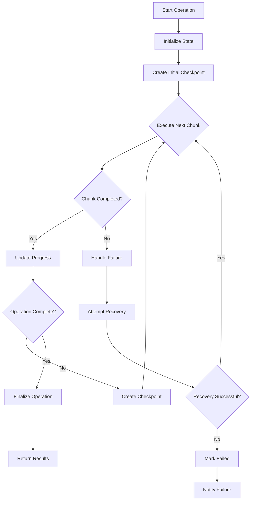

# 🔄 Incremental Execution Pattern

## 🎯 1. Task Understanding

**What needs to be built:** A robust incremental execution system for AI agents that enables long-running operations to be broken into manageable chunks, with progress tracking, checkpointing, and resume capabilities.

**What success looks like:**
- AI agents can execute complex operations incrementally without timeouts
- Progress is automatically tracked and persisted across sessions
- Operations can be resumed from any checkpoint after interruptions
- Users receive real-time progress updates and estimated completion times
- System resources are optimized by breaking large tasks into smaller units
- Execution state is recoverable after crashes or restarts

## 🧠 2. Assumptions & Constraints

**Technical Constraints:**
- Must support both CPU-bound and I/O-bound operations
- Should work across distributed systems and microservices
- Needs to handle state persistence across restarts and failures
- Must integrate with existing task queues and workflow engines
- Zero-dependencies core for reliability

**Business Constraints:**
- Support for long-running operations (hours to days)
- Compliance with data retention and privacy requirements
- Cost-effective execution with resource optimization
- Maintain user confidence through transparent progress reporting
- Support for business continuity during system maintenance

**Platform Constraints:**
- Cross-platform compatibility (Node.js, Python, browser, edge)
- Environment-specific configuration for different execution environments
- Support for both synchronous and asynchronous operation patterns
- Integration with existing monitoring and observability tools

## 🚀 3. Strategy & Approach

**Why this approach:** Traditional monolithic execution fails for long-running AI operations due to timeouts, resource constraints, and reliability issues. Incremental execution enables resilience, progress tracking, and user transparency.

**Alternatives considered:**
- **Monolithic execution:** Fails for long-running tasks due to timeouts and resource limits
- **Manual chunking:** Requires complex developer effort and error-prone state management
- **External workflow engines:** Adds dependency complexity and learning curve
- **Simple timeouts:** Loses execution context and progress information

**Trade-offs:**
- **Overhead vs Reliability:** Checkpointing adds overhead but enables recovery
- **Granularity vs Performance:** Smaller chunks improve resilience but increase coordination overhead
- **State size vs Resume capability:** More state enables better resumption but increases storage requirements

## 🏗️ 4. Detailed Architecture

### Core Components

```typescript
interface IncrementalOperation<TInput, TOutput, TState> {
  id: string;
  input: TInput;
  currentState: TState;
  progress: OperationProgress;
  status: OperationStatus;
  checkpoints: OperationCheckpoint[];
  metadata: OperationMetadata;
}

interface OperationProgress {
  currentStep: number;
  totalSteps: number;
  percentage: number;
  estimatedTimeRemaining: number;
  stepsCompleted: string[];
}

interface OperationCheckpoint {
  id: string;
  timestamp: Date;
  state: any;
  progress: OperationProgress;
  metadata: CheckpointMetadata;
}

enum OperationStatus {
  PENDING = 'pending',
  RUNNING = 'running',
  PAUSED = 'paused',
  COMPLETED = 'completed',
  FAILED = 'failed',
  CANCELLED = 'cancelled'
}
```

### Execution Flow



### State Management

```typescript
export class IncrementalExecutor<TInput, TOutput, TState> {
  private operation: IncrementalOperation<TInput, TOutput, TState>;
  private storage: StateStorage;
  private checkpointInterval: number;
  
  constructor(
    operationId: string,
    input: TInput,
    executor: ChunkExecutor<TInput, TOutput, TState>,
    storage: StateStorage = new MemoryStorage()
  ) {
    this.operation = {
      id: operationId,
      input,
      currentState: {} as TState,
      progress: this.initializeProgress(),
      status: OperationStatus.PENDING,
      checkpoints: [],
      metadata: { createdAt: new Date() }
    };
    this.storage = storage;
  }
  
  async execute(): Promise<TOutput> {
    this.operation.status = OperationStatus.RUNNING;
    await this.saveState();
    
    while (!this.isComplete()) {
      try {
        const result = await this.executeNextChunk();
        await this.updateProgress(result);
        
        if (this.shouldCheckpoint()) {
          await this.createCheckpoint();
        }
      } catch (error) {
        await this.handleError(error);
        throw error;
      }
    }
    
    return this.finalizeOperation();
  }
  
  async pause(): Promise<void> {
    this.operation.status = OperationStatus.PAUSED;
    await this.createCheckpoint();
    await this.saveState();
  }
  
  async resume(): Promise<TOutput> {
    if (this.operation.status !== OperationStatus.PAUSED) {
      throw new Error('Can only resume paused operations');
    }
    
    this.operation.status = OperationStatus.RUNNING;
    await this.loadLatestCheckpoint();
    return this.execute();
  }
}
```

### Progress Tracking

```typescript
interface ProgressTracker {
  trackProgress(operationId: string, progress: OperationProgress): Promise<void>;
  getProgress(operationId: string): Promise<OperationProgress>;
  subscribe(operationId: string, callback: ProgressCallback): Subscription;
}

class DefaultProgressTracker implements ProgressTracker {
  private progressMap: Map<string, OperationProgress> = new Map();
  private subscribers: Map<string, ProgressCallback[]> = new Map();
  
  async trackProgress(operationId: string, progress: OperationProgress): Promise<void> {
    this.progressMap.set(operationId, progress);
    
    const callbacks = this.subscribers.get(operationId) || [];
    for (const callback of callbacks) {
      try {
        callback(progress);
      } catch (error) {
        console.warn('Progress callback failed:', error);
      }
    }
  }
  
  subscribe(operationId: string, callback: ProgressCallback): Subscription {
    const callbacks = this.subscribers.get(operationId) || [];
    callbacks.push(callback);
    this.subscribers.set(operationId, callbacks);
    
    return {
      unsubscribe: () => {
        const updatedCallbacks = (this.subscribers.get(operationId) || [])
          .filter(cb => cb !== callback);
        this.subscribers.set(operationId, updatedCallbacks);
      }
    };
  }
}
```

## 🛠️ 5. Execution Artifacts

### Core Implementation

```typescript
// Operation definition and management
export function defineIncrementalOperation<TInput, TOutput, TState>(
  config: OperationConfig<TInput, TOutput, TState>
): IncrementalOperationDef<TInput, TOutput, TState> {
  return {
    id: config.id,
    version: config.version || '1.0.0',
    chunkSize: config.chunkSize || 100,
    checkpointInterval: config.checkpointInterval || 5,
    maxRetries: config.maxRetries || 3,
    timeout: config.timeout || 300000,
    
    execute: async (input: TInput, state?: TState) => {
      const executor = new IncrementalExecutor(
        config.id,
        input,
        config.executeChunk,
        config.storage || new MemoryStorage()
      );
      
      if (state) {
        await executor.restoreState(state);
      }
      
      return executor.execute();
    }
  };
}

// Chunk execution interface
interface ChunkExecutor<TInput, TOutput, TState> {
  (
    input: TInput,
    state: TState,
    progress: OperationProgress,
    chunkIndex: number
  ): Promise<ChunkResult<TOutput, TState>>;
}

interface ChunkResult<TOutput, TState> {
  output?: TOutput;
  nextState: TState;
  progressUpdate: Partial<OperationProgress>;
  completed?: boolean;
}
```

### Storage Adapters

```typescript
// Base storage interface
interface StateStorage {
  saveOperation(operation: IncrementalOperation<any, any, any>): Promise<void>;
  loadOperation(operationId: string): Promise<IncrementalOperation<any, any, any>>;
  deleteOperation(operationId: string): Promise<void>;
  listOperations(status?: OperationStatus): Promise<string[]>;
}

// Memory storage (development)
class MemoryStorage implements StateStorage {
  private operations: Map<string, IncrementalOperation<any, any, any>> = new Map();
  
  async saveOperation(operation: IncrementalOperation<any, any, any>): Promise<void> {
    this.operations.set(operation.id, operation);
  }
  
  async loadOperation(operationId: string): Promise<IncrementalOperation<any, any, any>> {
    const operation = this.operations.get(operationId);
    if (!operation) {
      throw new Error(`Operation ${operationId} not found`);
    }
    return operation;
  }
}

// Redis storage (production)
class RedisStorage implements StateStorage {
  constructor(private redisClient: RedisClient) {}
  
  async saveOperation(operation: IncrementalOperation<any, any, any>): Promise<void> {
    const key = this.getKey(operation.id);
    const data = JSON.stringify(operation);
    await this.redisClient.setex(key, 86400, data); // 24h TTL
  }
  
  private getKey(operationId: string): string {
    return `incremental:operation:${operationId}`;
  }
}
```

### React Integration

```typescript
// React hook for progress tracking
function useIncrementalOperation<TInput, TOutput, TState>(
  operationDef: IncrementalOperationDef<TInput, TOutput, TState>,
  input: TInput
) {
  const [progress, setProgress] = useState<OperationProgress>({
    currentStep: 0,
    totalSteps: 0,
    percentage: 0,
    estimatedTimeRemaining: 0,
    stepsCompleted: []
  });
  
  const [status, setStatus] = useState<OperationStatus>(OperationStatus.PENDING);
  const [result, setResult] = useState<TOutput | null>(null);
  const [error, setError] = useState<Error | null>(null);
  
  const execute = useCallback(async () => {
    setStatus(OperationStatus.RUNNING);
    setError(null);
    
    try {
      const tracker = new DefaultProgressTracker();
      const subscription = tracker.subscribe(operationDef.id, setProgress);
      
      const output = await operationDef.execute(input, {
        progressTracker: tracker
      });
      
      setResult(output);
      setStatus(OperationStatus.COMPLETED);
      subscription.unsubscribe();
      
      return output;
    } catch (err) {
      setError(err as Error);
      setStatus(OperationStatus.FAILED);
      throw err;
    }
  }, [operationDef, input]);
  
  return {
    execute,
    progress,
    status,
    result,
    error,
    isPending: status === OperationStatus.PENDING,
    isRunning: status === OperationStatus.RUNNING,
    isCompleted: status === OperationStatus.COMPLETED,
    isFailed: status === OperationStatus.FAILED
  };
}
```

### OpenAI Function Integration

```typescript
// OpenAI function for incremental execution
export function createIncrementalExecutionTool() {
  return {
    type: "function" as const,
    function: {
      name: "execute_incrementally",
      description: "Execute a long-running operation incrementally with progress tracking",
      parameters: {
        type: "object",
        properties: {
          operation_id: {
            type: "string",
            description: "Unique identifier for the operation"
          },
          operation_type: {
            type: "string",
            enum: ["data_processing", "file_operation", "api_integration", "computation"],
            description: "Type of operation being performed"
          },
          total_steps: {
            type: "number",
            description: "Total number of steps expected"
          },
          chunk_size: {
            type: "number",
            description: "Number of items to process per chunk"
          },
          timeout_ms: {
            type: "number",
            description: "Timeout for the entire operation in milliseconds"
          },
          checkpoint_interval: {
            type: "number",
            description: "How often to create checkpoints (number of chunks)"
          }
        },
        required: ["operation_id", "operation_type", "total_steps"]
      }
    }
  };
}

// Wrapper for AI agent operations
async function executeWithIncrementalProgress(
  operationId: string,
  operation: () => Promise<any>,
  progressCallback?: (progress: number) => void
) {
  const executor = new IncrementalExecutor(operationId, {}, async () => {
    const result = await operation();
    return { output: result, nextState: {}, progressUpdate: { percentage: 100 } };
  });
  
  if (progressCallback) {
    executor.onProgress(progressCallback);
  }
  
  return executor.execute();
}
```

## ✅ 6. Quality & Review Checklist

### Implementation Quality
- [ ] **Type Safety:** Complete TypeScript definitions for all interfaces
- [ ] **Error Handling:** Comprehensive error handling with recovery mechanisms
- [ ] **Testing:** Unit tests for core components with >90% coverage
- [ ] **Performance:** Benchmark tests for memory usage and execution time
- [ ] **Documentation:** JSDoc comments for all public methods and interfaces

### Production Readiness
- [ ] **State Persistence:** Multiple storage adapters (memory, Redis, database)
- [ ] **Monitoring:** Integration with observability tools (Prometheus, Datadog)
- [ ] **Security:** Data encryption for sensitive operation state
- [ ] **Scalability:** Support for distributed execution across multiple nodes
- [ ] **Backward Compatibility:** Versioning for operation definitions

### User Experience
- [ ] **Progress Reporting:** Real-time progress updates with ETA calculations
- [ ] **Resume Capability:** Operations can be resumed after interruptions
- [ ] **Transparency:** Clear error messages and operation status
- [ ] **Control:** Users can pause, resume, and cancel operations
- [ ] **Efficiency:** Minimal overhead for checkpointing and state management

### Compliance & Standards
- [ ] **Data Retention:** Configurable retention policies for operation state
- [ ] **Privacy:** GDPR-compliant handling of personal data in operation state
- [ ] **Audit Logging:** Comprehensive audit trails for operation execution
- [ ] **Access Control:** Role-based access to operations and their state

## 🚀 7. Future Enhancements

### Short-term (Next 3 months)
- **Adaptive chunk sizing** based on execution performance
- **Priority-based execution** for critical operations
- **Cross-device synchronization** for mobile and desktop
- **Enhanced progress visualization** with charts and analytics

### Medium-term (3-6 months)
- **Machine learning integration** for predicting operation duration
- **Federated execution** across multiple AI agents
- **Blockchain-based checkpointing** for tamper-proof operation history
- **Quantum-resistant encryption** for operation state security

### Long-term (6-12 months)
- **AI-assisted operation optimization** automatic chunk sizing and strategy selection
- **Cross-platform operation migration** moving operations between environments
- **Predictive resume** anticipating where operations will need to resume
- **Self-healing operations** automatic recovery from complex failure scenarios

### Research Directions
- **Reinforcement learning** for optimal checkpoint interval determination
- **Homomorphic encryption** for privacy-preserving incremental execution
- **Fault-tolerant consensus** for distributed operation state management
- **Energy-aware execution** optimizing for battery life on mobile devices

---

This incremental execution pattern provides a production-ready foundation for managing long-running AI operations with resilience, transparency, and user control. The architecture enables seamless integration with existing systems while providing the robustness needed for mission-critical AI applications.