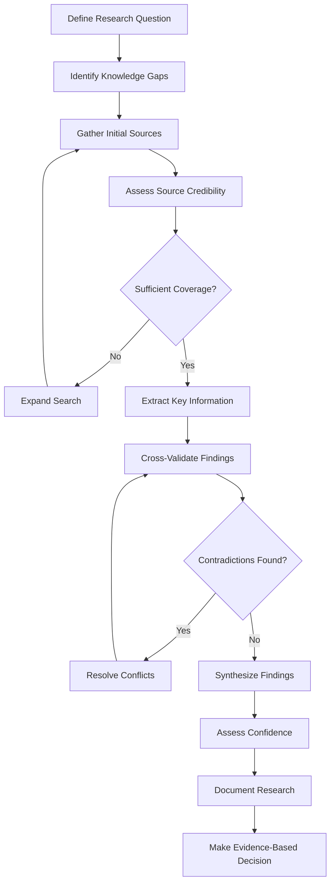

# 🔍 Research-First Pattern

## 🎯 1. Task Understanding

**What needs to be built:** A systematic research-first approach for AI agents that ensures comprehensive knowledge gathering, source validation, and evidence-based decision making before taking action.

**What success looks like:**
- AI agents automatically conduct thorough research before executing complex tasks
- Multiple credible sources are consulted and cross-verified
- Information is validated for accuracy, recency, and relevance
- Research findings are documented with proper citations and sources
- Decisions are based on evidence rather than assumptions or limited knowledge
- Research process is transparent and reproducible

## 🧠 2. Assumptions & Constraints

**Technical Constraints:**
- Must integrate with multiple knowledge sources and APIs (web search, databases, documents)
- Should handle real-time information retrieval and processing
- Needs to support source credibility assessment and ranking
- Must work within token limits and API rate limits
- Zero-dependencies core for reliability

**Business Constraints:**
- Compliance with copyright and fair use regulations
- Support for fact-checking and misinformation prevention
- Cost-effective research within budget constraints
- Maintain user trust through transparent sourcing
- Support for audit trails and research provenance

**Platform Constraints:**
- Cross-platform compatibility (Node.js, Python, browser, edge)
- Integration with existing knowledge management systems
- Support for multiple document formats and data sources
- Environment-specific configuration for different research domains

## 🚀 3. Strategy & Approach

**Why this approach:** Traditional AI execution often acts on limited or unverified information, leading to errors, inaccuracies, and poor decisions. Research-first ensures evidence-based actions and reduces mistakes.

**Alternatives considered:**
- **Execute first, research later:** Leads to errors and rework
- **Single source reliance:** Creates bias and incomplete understanding
- **Manual research:** Doesn't scale with AI agent complexity
- **Simple web search:** Lacks validation and credibility assessment

**Trade-offs:**
- **Thoroughness vs Speed:** More comprehensive research takes longer but produces better results
- **Breadth vs Depth:** Wider research covers more angles but may lack depth in specific areas
- **Automation vs Control:** Balance between automatic research and human guidance
- **Cost vs Quality:** More sources and validation increase cost but improve quality

## 🏗️ 4. Detailed Architecture

### Core Components

```typescript
interface ResearchTask {
  id: string;
  query: string;
  domain: ResearchDomain;
  depth: ResearchDepth;
  sources: ResearchSource[];
  findings: ResearchFinding[];
  confidence: number;
  status: ResearchStatus;
  metadata: ResearchMetadata;
}

interface ResearchSource {
  id: string;
  type: SourceType;
  url: string;
  title: string;
  author: string;
  publicationDate: Date;
  credibility: CredibilityScore;
  relevance: number;
  content: string;
}

interface ResearchFinding {
  id: string;
  claim: string;
  supportingSources: string[];
  contradictingSources: string[];
  confidence: number;
  verificationStatus: VerificationStatus;
  implications: string[];
}

enum ResearchStatus {
  PENDING = 'pending',
  GATHERING = 'gathering',
  ANALYZING = 'analyzing',
  VERIFYING = 'verifying',
  COMPLETED = 'completed',
  FAILED = 'failed'
}

enum ResearchDepth {
  QUICK = 'quick',      // 1-2 sources, basic validation
  STANDARD = 'standard', // 3-5 sources, cross-verification
  DEEP = 'deep',        // 6+ sources, comprehensive analysis
  EXPERT = 'expert'     // 10+ sources, expert review
}
```

### Research Flow



### Research Engine

```typescript
export class ResearchFirstEngine {
  private knowledgeSources: KnowledgeSource[];
  private credibilityAssessor: CredibilityAssessor;
  private factChecker: FactChecker;
  
  constructor(
    sources: KnowledgeSource[] = [new WebSearchSource(), new DatabaseSource()],
    credibilityAssessor: CredibilityAssessor = new DefaultCredibilityAssessor(),
    factChecker: FactChecker = new CrossValidationFactChecker()
  ) {
    this.knowledgeSources = sources;
    this.credibilityAssessor = credibilityAssessor;
    this.factChecker = factChecker;
  }
  
  async conductResearch(task: ResearchTask): Promise<ResearchResult> {
    // Phase 1: Source Gathering
    const initialSources = await this.gatherSources(task);
    const assessedSources = await this.assessCredibility(initialSources);
    
    // Phase 2: Information Extraction
    const extractedInfo = await this.extractInformation(assessedSources, task);
    
    // Phase 3: Validation & Synthesis
    const validatedFindings = await this.validateFindings(extractedInfo);
    const synthesizedResults = await this.synthesizeResults(validatedFindings);
    
    // Phase 4: Confidence Assessment
    const confidence = await this.assessConfidence(synthesizedResults);
    
    return {
      task,
      sources: assessedSources,
      findings: synthesizedResults,
      confidence,
      recommendations: this.generateRecommendations(synthesizedResults),
      limitations: this.identifyLimitations(assessedSources)
    };
  }
  
  private async gatherSources(task: ResearchTask): Promise<ResearchSource[]> {
    const sources: ResearchSource[] = [];
    
    for (const source of this.knowledgeSources) {
      try {
        const results = await source.search(task.query, task.domain, task.depth);
        sources.push(...results);
      } catch (error) {
        console.warn(`Source ${source.name} failed:`, error);
      }
    }
    
    return sources;
  }
  
  private async assessCredibility(sources: ResearchSource[]): Promise<ResearchSource[]> {
    return Promise.all(
      sources.map(async source => ({
        ...source,
        credibility: await this.credibilityAssessor.assess(source)
      }))
    );
  }
}
```

### Credibility Assessment

```typescript
interface CredibilityAssessor {
  assess(source: ResearchSource): Promise<CredibilityScore>;
}

class DefaultCredibilityAssessor implements CredibilityAssessor {
  private credibilityFactors: CredibilityFactor[] = [
    {
      name: 'authority',
      weight: 0.3,
      assess: (source) => this.assessAuthority(source)
    },
    {
      name: 'recency',
      weight: 0.25,
      assess: (source) => this.assessRecency(source)
    },
    {
      name: 'accuracy',
      weight: 0.25,
      assess: (source) => this.assessAccuracy(source)
    },
    {
      name: 'bias',
      weight: 0.2,
      assess: (source) => this.assessBias(source)
    }
  ];
  
  async assess(source: ResearchSource): Promise<CredibilityScore> {
    const factorScores: number[] = [];
    
    for (const factor of this.credibilityFactors) {
      const score = await factor.assess(source);
      factorScores.push(score * factor.weight);
    }
    
    const totalScore = factorScores.reduce((sum, score) => sum + score, 0);
    
    return {
      score: totalScore,
      factors: this.credibilityFactors.map((factor, index) => ({
        name: factor.name,
        score: factorScores[index] / factor.weight,
        weight: factor.weight
      })),
      overall: this.getOverallRating(totalScore)
    };
  }
  
  private assessAuthority(source: ResearchSource): number {
    // Assess author credentials, publisher reputation, citations
    const authoritySignals = [
      source.author?.includes('PhD') ? 1 : 0.5,
      source.url?.includes('.edu') ? 1 : 0.7,
      source.url?.includes('.gov') ? 1 : 0.8,
      source.url?.includes('.org') ? 0.8 : 0.6
    ];
    
    return authoritySignals.reduce((sum, signal) => sum + signal, 0) / authoritySignals.length;
  }
  
  private getOverallRating(score: number): CredibilityRating {
    if (score >= 0.8) return 'excellent';
    if (score >= 0.6) return 'good';
    if (score >= 0.4) return 'fair';
    return 'poor';
  }
}
```

## 🛠️ 5. Execution Artifacts

### Core Implementation

```typescript
// Research task definition and execution
export function defineResearchTask(config: ResearchTaskConfig): ResearchTaskDef {
  return {
    id: config.id,
    version: config.version || '1.0.0',
    minSources: config.minSources || 3,
    maxSources: config.maxSources || 10,
    requiredConfidence: config.requiredConfidence || 0.7,
    timeout: config.timeout || 300000,
    allowedDomains: config.allowedDomains || [],
    blockedDomains: config.blockedDomains || [],
    
    execute: async (query: string, depth: ResearchDepth = ResearchDepth.STANDARD) => {
      const engine = new ResearchFirstEngine(
        config.sources || [new WebSearchSource(), new DatabaseSource()],
        config.credibilityAssessor || new DefaultCredibilityAssessor(),
        config.factChecker || new CrossValidationFactChecker()
      );
      
      const task: ResearchTask = {
        id: config.id,
        query,
        domain: config.domain || 'general',
        depth,
        sources: [],
        findings: [],
        confidence: 0,
        status: ResearchStatus.PENDING,
        metadata: { createdAt: new Date() }
      };
      
      return engine.conductResearch(task);
    }
  };
}

// Knowledge source interface
interface KnowledgeSource {
  name: string;
  search(query: string, domain: string, depth: ResearchDepth): Promise<ResearchSource[]>;
  getContent(source: ResearchSource): Promise<string>;
  isAvailable(): Promise<boolean>;
}

// Web search implementation
class WebSearchSource implements KnowledgeSource {
  name = 'web-search';
  
  async search(query: string, domain: string, depth: ResearchDepth): Promise<ResearchSource[]> {
    const results = await this.performWebSearch(query, this.getResultCount(depth));
    return results.map(result => ({
      id: this.generateId(),
      type: 'web' as const,
      url: result.url,
      title: result.title,
      author: result.author,
      publicationDate: new Date(result.date),
      credibility: { score: 0.5, factors: [], overall: 'unknown' },
      relevance: this.calculateRelevance(result, query),
      content: result.snippet
    }));
  }
  
  private getResultCount(depth: ResearchDepth): number {
    switch (depth) {
      case ResearchDepth.QUICK: return 3;
      case ResearchDepth.STANDARD: return 5;
      case ResearchDepth.DEEP: return 8;
      case ResearchDepth.EXPERT: return 15;
      default: return 5;
    }
  }
}
```

### Fact Checking

```typescript
interface FactChecker {
  checkFact(claim: string, sources: ResearchSource[]): Promise<FactCheckResult>;
  findContradictions(findings: ResearchFinding[]): Promise<Contradiction[]>;
}

class CrossValidationFactChecker implements FactChecker {
  async checkFact(claim: string, sources: ResearchSource[]): Promise<FactCheckResult> {
    const supportingSources: ResearchSource[] = [];
    const contradictingSources: ResearchSource[] = [];
    
    for (const source of sources) {
      const content = await this.getSourceContent(source);
      const supports = await this.doesSourceSupportClaim(content, claim);
      
      if (supports) {
        supportingSources.push(source);
      } else {
        const contradicts = await this.doesSourceContradictClaim(content, claim);
        if (contradicts) {
          contradictingSources.push(source);
        }
      }
    }
    
    const confidence = this.calculateConfidence(supportingSources, contradictingSources);
    
    return {
      claim,
      supportingSources,
      contradictingSources,
      confidence,
      verdict: this.getVerdict(confidence, supportingSources.length, contradictingSources.length),
      explanation: this.generateExplanation(supportingSources, contradictingSources)
    };
  }
  
  private calculateConfidence(supporting: ResearchSource[], contradicting: ResearchSource[]): number {
    const totalRelevant = supporting.length + contradicting.length;
    if (totalRelevant === 0) return 0;
    
    const supportWeight = supporting.reduce((sum, source) => sum + source.credibility.score, 0);
    const contradictWeight = contradicting.reduce((sum, source) => sum + source.credibility.score, 0);
    
    return supportWeight / (supportWeight + contradictWeight);
  }
}
```

### React Integration

```typescript
// React hook for research tasks
function useResearchTask<T extends ResearchTask>(
  taskDef: ResearchTaskDef,
  initialQuery: string
) {
  const [research, setResearch] = useState<ResearchResult | null>(null);
  const [status, setStatus] = useState<ResearchStatus>(ResearchStatus.PENDING);
  const [progress, setProgress] = useState<ResearchProgress>({
    sourcesGathered: 0,
    sourcesAssessed: 0,
    findingsExtracted: 0,
    findingsValidated: 0
  });
  
  const executeResearch = useCallback(async (query: string, depth: ResearchDepth) => {
    setStatus(ResearchStatus.GATHERING);
    
    try {
      const result = await taskDef.execute(query, depth);
      setResearch(result);
      setStatus(ResearchStatus.COMPLETED);
      return result;
    } catch (error) {
      setStatus(ResearchStatus.FAILED);
      throw error;
    }
  }, [taskDef]);
  
  return {
    executeResearch,
    research,
    status,
    progress,
    isPending: status === ResearchStatus.PENDING,
    isGathering: status === ResearchStatus.GATHERING,
    isAnalyzing: status === ResearchStatus.ANALYZING,
    isVerifying: status === ResearchStatus.VERIFYING,
    isCompleted: status === ResearchStatus.COMPLETED,
    isFailed: status === ResearchStatus.FAILED
  };
}

// Research progress component
function ResearchProgressIndicator({ progress, status }: {
  progress: ResearchProgress;
  status: ResearchStatus;
}) {
  return (
    <div className="research-progress">
      <div className="status">Status: {status}</div>
      <div className="metrics">
        <span>Sources: {progress.sourcesGathered} gathered, {progress.sourcesAssessed} assessed</span>
        <span>Findings: {progress.findingsExtracted} extracted, {progress.findingsValidated} validated</span>
      </div>
      <progress 
        value={progress.sourcesAssessed} 
        max={progress.sourcesGathered || 1}
      />
    </div>
  );
}
```

### OpenAI Function Integration

```typescript
// OpenAI function for research-first execution
export function createResearchFirstTool() {
  return {
    type: "function" as const,
    function: {
      name: "conduct_research",
      description: "Conduct thorough research before taking action, gathering multiple credible sources and validating information",
      parameters: {
        type: "object",
        properties: {
          research_query: {
            type: "string",
            description: "The research question or topic to investigate"
          },
          research_depth: {
            type: "string",
            enum: ["quick", "standard", "deep", "expert"],
            description: "Depth of research to conduct"
          },
          min_confidence: {
            type: "number",
            description: "Minimum confidence level required (0.0 to 1.0)"
          },
          max_sources: {
            type: "number",
            description: "Maximum number of sources to consult"
          },
          domain_restrictions: {
            type: "array",
            items: { type: "string" },
            description: "Allowed domains for research"
          },
          timeout_seconds: {
            type: "number",
            description: "Timeout for research in seconds"
          }
        },
        required: ["research_query", "research_depth"]
      }
    }
  };
}

// Wrapper for AI agent research
export async function researchBeforeAction(
  action: () => Promise<any>,
  researchQuery: string,
  options: ResearchOptions = {}
) {
  const researchTask = defineResearchTask({
    id: 'pre-action-research',
    minSources: options.minSources || 3,
    requiredConfidence: options.minConfidence || 0.7,
    timeout: options.timeout || 120000
  });
  
  const researchResult = await researchTask.execute(researchQuery, options.depth || ResearchDepth.STANDARD);
  
  if (researchResult.confidence < (options.minConfidence || 0.7)) {
    throw new Error(`Research confidence too low: ${researchResult.confidence}. Required: ${options.minConfidence || 0.7}`);
  }
  
  // Only proceed with action if research meets confidence threshold
  return action();
}
```

## ✅ 6. Quality & Review Checklist

### Implementation Quality
- [ ] **Type Safety:** Complete TypeScript definitions for all research interfaces
- [ ] **Source Diversity:** Support for multiple knowledge sources and APIs
- [ ] **Validation:** Comprehensive fact-checking and cross-validation
- [ ] **Testing:** Unit tests for research components with >90% coverage
- [ ] **Documentation:** JSDoc comments for all research methods and interfaces

### Production Readiness
- [ ] **Rate Limiting:** Proper handling of API rate limits and quotas
- [ ] **Error Handling:** Graceful degradation when sources are unavailable
- [ ] **Caching:** Intelligent caching of research results
- [ ] **Scalability:** Support for distributed research across multiple agents
- [ ] **Monitoring:** Integration with research performance metrics

### Research Quality
- [ ] **Source Credibility:** Multi-factor credibility assessment
- [ ] **Bias Detection:** Identification of source bias and perspective
- [ ] **Recency Validation:** Ensuring information is current and relevant
- [ ] **Cross-Validation:** Multiple source verification for key facts
- [ ] **Transparency:** Clear documentation of research methodology

### Compliance & Ethics
- [ ] **Copyright Compliance:** Proper handling of copyrighted material
- [ ] **Fair Use:** Adherence to fair use guidelines
- [ ] **Privacy:** Respect for personal data and privacy regulations
- [ ] **Transparency:** Clear attribution of sources and citations
- [ ] **Bias Mitigation:** Procedures to identify and mitigate research bias

## 🚀 7. Future Enhancements

### Short-term (Next 3 months)
- **Multi-lingual research** support for non-English sources
- **Domain-specific research** templates for different industries
- **Real-time research** integration with live data sources
- **Collaborative research** sharing findings across AI agents

### Medium-term (3-6 months)
- **AI-assisted source evaluation** machine learning for credibility assessment
- **Research quality scoring** automated quality assessment of research methodology
- **Knowledge graph integration** connecting research findings into semantic networks
- **Predictive research** anticipating research needs based on context

### Long-term (6-12 months)
- **Automated literature reviews** comprehensive analysis of research landscapes
- **Research synthesis AI** automatically generating research summaries and insights
- **Cross-modal research** integrating text, audio, video, and data sources
- **Ethical AI research** frameworks for responsible research practices

### Research Directions
- **Federated research** distributed research across multiple AI systems
- **Explainable research** transparent reasoning behind research conclusions
- **Adaptive research** dynamically adjusting research depth based on complexity
- **Cognitive bias mitigation** techniques to reduce research biases

---

This research-first pattern provides a production-ready foundation for evidence-based AI decision making. The architecture ensures comprehensive knowledge gathering, rigorous validation, and transparent sourcing, enabling AI agents to make informed decisions based on credible evidence rather than assumptions or limited information.